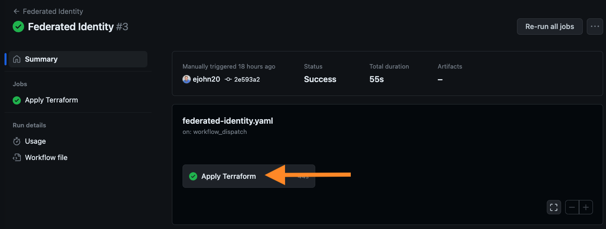
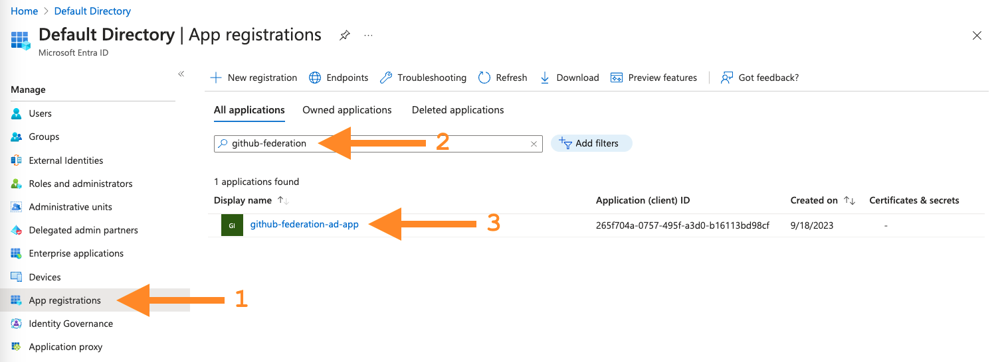
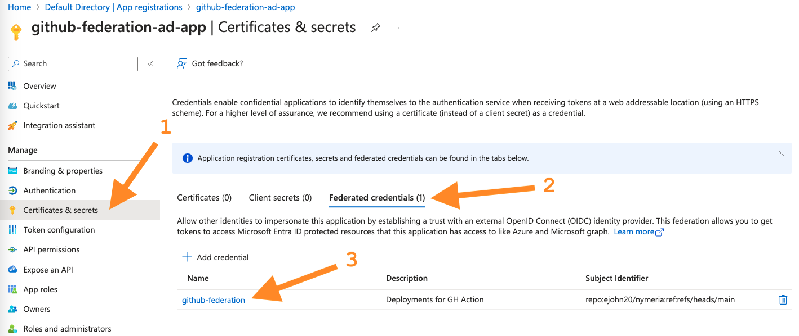

# Azure Identity Federation

During the [Getting Started](./getting_started.md) section, you deployed the *Federated Identity* GitHub Action. Without realizing it, you used Azure's workload identity federation capability to deploy the Nymeria virtual machine to your Azure subscription. In this section, we will explore how the GitHub Action uses Azure's workload identity federation capability to authenticate to the Azure API.

## GitHub Action Federation

Inspect the GitHub *Federated Identity* workflow and identify the OIDC token's subject, issuer, and audience claims.

1. In your GitHub repository, navigate to the *Actions* tab and click on the *Federated Identity* workflow. Then, select the completed *Federated Identity* run to view the completed jobs.

    

1. Select the *Apply Terraform* job to view the steps.

    

1. Expand the *Azure Login* step to view the log output from the the `azure/login` action. Observe the following log output from the `azure/login` action showing the federated token details.

    - The identity token's issuer is set to `https://token.actions.githubusercontent.com `.

    - The identity token's subject uniquely identifies your `nymeria` repository and `main` branch running the *Federated Identity* workflow.

    !!! abstract "Console Output"
        ```bash
        Using OIDC authentication...
        Federated token details:
        issuer - https://token.actions.githubusercontent.com
        subject claim - repo:[YOUR_GITHUB_USERNAME]/nymeria:ref:refs/heads/main
        ```

1. Expand the  `azure/login` action `run` details to view the action's inputs variables. The `azure/login` action uses the `client-id`, `tenant-id`, and `subscription-id` parameters to authenticate to the Azure API. The `audience` parameter is used when requesting an OpenID Connect (OIDC) identity token from the [GitHub Actions OpenID Connect Identity Provider](https://docs.github.com/en/actions/deployment/security-hardening-your-deployments/about-security-hardening-with-openid-connect){: target="_blank" rel="noopener"}. The `audience` parameter uses the default value `api://AzureADTokenExchange` from the `azure/login` action, but is configurable if a different audience is desired.

    !!! abstract "Console Output"
        ```bash
        Run azure/login@v1.4.6
        with:
          client-id: ***
          tenant-id: ***
          subscription-id: ***
          enable-AzPSSession: false
          environment: azurecloud
          allow-no-subscriptions: false
          audience: api://AzureADTokenExchange
        ```

## Azure Service Principal Configuration

Confirm the Azure service principal's federated identity configuration matches the GitHub *Federated Identity* workflow's OIDC token claims.

1. In the Azure portal, navigate to the *Microsoft Entra ID* service. Select the [App registrations](https://portal.azure.com/#view/Microsoft_AAD_IAM/ActiveDirectoryMenuBlade/~/RegisteredApps){: target="_blank" rel="noopener"} menu item to view the list of applications. Then, select the *All applications* option to view all registered applications, search for the `github-federation-ad-app` application, and open the details.

    

1. Select the *Certificates & secrets* menu item to view the list of certificates and secrets. Observe that there are no *Client Secrets* associated with the service principal. However, there is one *Federated credential*. Open the `github-federation` credential to view the details.

    

1. This federated credential resource establishes trust between the GitHub Actions OIDC provider and the service principal. Confirm the configuration matches the GitHub Actions OIDC provider's issuer claim.

    * The **Issuer** matches the GitHub Action OIDC token's issuer claim: `https://token.actions.githubusercontent.com`.

    * The **Subject identifier** matches the GitHub Action OIDC token's `sub` claim: `repo:[YOUR_GITHUB_USERNAME]/nymeria:ref:refs/heads/main`.

    * The **Audience** matches the GitHub Action OIDC token's `aud` claim: `api://AzureADTokenExchange`.

    

## Next Steps

!!! success "Azure Workload Identity"
    With this configuration, we have successfully killed the Azure service principal's long-lived credential. The `azure/login` action uses the GitHub Actions OIDC token to authenticate to the Azure tenant instead of the service principal's client secret.

Next, move on to the [AWS Identity Federation](./aws.md) section to learn how to authenticate the Nymeria virtual machine using AWS Identity Federation.
