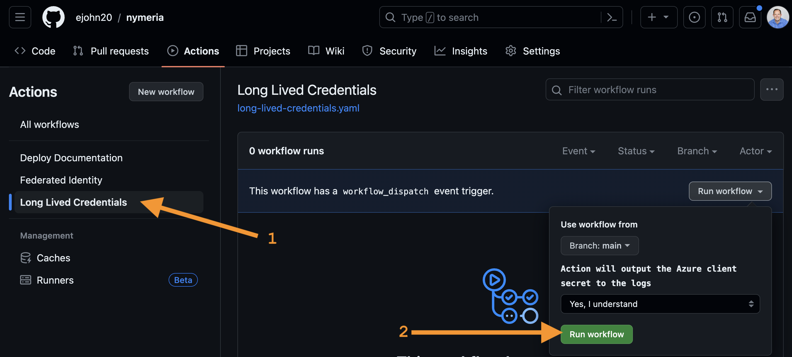
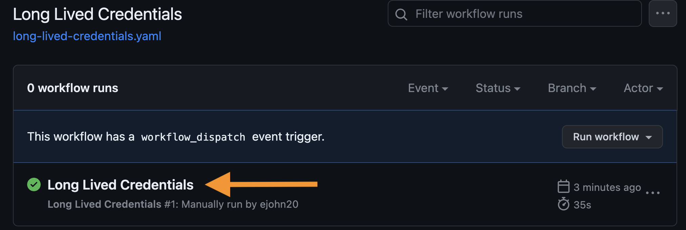
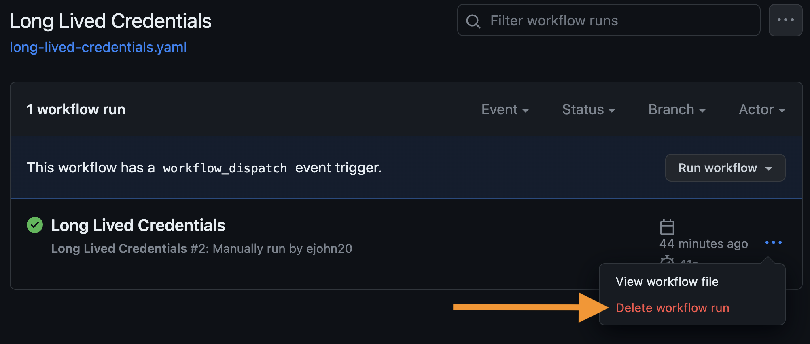

# Long Lived Credentials

Explore Nymeria's long lived credentials for each cloud provider: Azure, AWS, and Google Cloud. Use each long lived credential to access resources in each cloud provider.

## GitHub Action Credentials

From the GitHub Action called *Long Lived Credentials*, find the Azure tenant id, client id, and client secret values in the log output.

!!! warning "Stolen Credentials"
    Running the `long-lived-credentials` action will purposely expose an Azure client id and client secret in the GitHub Actions logs. The service principal  permissions only have the *Reader* role on the `nymeria-workshop` resource group, which currently has no data to exfiltrate. However, these credentials are real and should be immediately deleted at the end of this to prevent exposure. You can skip this section if you are not comfortable with this risk.

1. In your GitHub repository, navigate to the *Actions* tab. Then, click on the *I understand my workflows, go ahead and enable them.* button.

    

1. Click on the *Long Lived Credentials* workflow. Then, click on the *Run workflow* button to start the workflow on the `main` branch.

    

1. Select the completed run of the *Long Lived Credentials* action to view the jobs.

    

1. Select the *Apply Terraform* job to view the steps.

    

1. Expand the *Azure Login* step to find the Azure tenant id, client id, and client secret values in the log output.

    ```bash
    Run azure/login@v1.4.6
        with:
        creds: ***"clientId":"[your-client-id]","clientSecret":"[your-client-secret]","subscriptionId":"[your-subscription-id]","tenantId":"[your-tenant-id]"***
        enable-AzPSSession: false
        environment: azurecloud
        allow-no-subscriptions: false
        audience: api://AzureADTokenExchange
    ```

1. These long-lived credentials are being used to authenticate to the Azure subscription. Observe the GitHub Action also shows a *Note* suggesting that we use a a federated credential to use OIDC based authentication.

    ```bash
    Note: Azure/login action also supports OIDC login mechanism. Refer https://github.com/azure/login#configure-a-service-principal-with-a-federated-credential-to-use-oidc-based-authentication for more details.
    Login successful.
    ```

## Azure Service Principal Secret

Use the long-lived stolen client id and secret values to authenticate to the Azure tenant.

1. Browse to the [Azure Portal](https://portal.azure.com/){: target="_blank" rel="noopener"} open **Cloud Shell** again.

    

1. Start by running the `az ad signed-in-user show` command. Observe you are signed into the Terminal under your personal account.

    ```bash
    az ad signed-in-user show
    ```

    !!! abstract "Terminal Output"
        ```bash
        {
          "@odata.context": "https://graph.microsoft.com/v1.0/$metadata#users/$entity",
          "businessPhones": [],
          "displayName": "Last Name, First Name,
          "givenName": "First Name",
          "id": "2e164a5a-1ebd-4f3e-ab84-18165db3e826",
          "jobTitle": "Hacker",
          "mail": "user@pumasecurity.io",
          "mobilePhone": null,
          "officeLocation": null,
          "preferredLanguage": null,
          "surname": "Last Name",
          "userPrincipalName": "user@pumasecurity.io"
        }
        ```

1. Set the following environment variables to the stolen service principal credentials.

    ```bash
    ARM_TENANT_ID=[STOLEN_TENANT_ID]
    ARM_CLIENT_ID=[STOLEN_CLIENT_ID]
    ARM_CLIENT_SECRET=[STOLEN_CLIENT_SECRET]
    ARM_SUBSCRIPTION_ID=[STOLEN_SUBSCRIPTION_ID]
    ```

1. Use the stolen service principal credentials to authenticate to the Azure tenant and set the subscription.

    ```bash
    az login --service-principal -u $ARM_CLIENT_ID -p $ARM_CLIENT_SECRET --tenant $ARM_TENANT_ID
    az account set --subscription $ARM_SUBSCRIPTION_ID
    ```

1. The following command will list the resource groups that the service principal has access to: `nymeria-workshop`.

    ```bash
    az group list
    ```

    !!! abstract "Terminal Output"
        ```bash
        Name              Location    Status
        ----------------  ----------  ---------
        nymeria-workshop  eastus      Succeeded
        ```

1. The following command will list the storage accounts in the `nymeria-workshop` resource group. The output will confirm you are able to view the storage account containing the Nymeria Terraform state data.

    ```bash
    az storage account list -g nymeria-workshop -o table --query "[].{resourceGroup:resourceGroup, name:name}"
    ```

    !!! abstract "Terminal Output"
        ```bash
        ResourceGroup     Name
        ----------------  -----------------
        nymeria-workshop  terraform9s6ogn1e
        ```

1. Now that we have proven the stolen credentials work, restart the Azure Cloud Shell to re-authenticate under your personal account.

1. Run the following command to delete the compromised service principal from your Azure subscription.

    ```bash
    LONG_LIVED_SP_ID=$(az ad sp list --display-name github-creds-ad-app | jq -r '.[].id')
    az ad sp delete --id $LONG_LIVED_SP_ID
    ```

1. Finally, go back to the GitHub repository and delete the run that contained the stolen credentials.

    

## AWS Access Key

1. Find the long lived AWS credentials on the Nymeria virtual machine.

    ```bash
    ls -la ~/.aws/
    cat ~/.aws/credentials
    ```

1. Use the long lived credentials to access the data in AWS S3.

    ```bash
    export AWS_PROFILE=cross-cloud
    aws sts get-caller-identity

    source ~/.aws/get-resources.sh 
    echo $AWS_S3_BUCKET_ID
    aws s3 cp s3://$AWS_S3_BUCKET_ID/aws-workload-identity.png ~/aws-long-lived-credentials.png

    ls -la ~/aws-long-lived-credentials.png
    ```

## Google Cloud Service Account Key

1. Find the long lived Google Cloud credentials on the Nymeria virtual machine.

    ```bash
    ls -la ~/.config/gcloud/
    cat ~/.config/gcloud/cross-cloud-key.json
    ```

1. Use the long lived credentials to access the data in GCS.

    ```bash
    gcloud auth activate-service-account --key-file=/home/ubuntu/.config/gcloud/cross-cloud-key.json

    GCP_TOKEN=$(gcloud auth print-identity-token)
    jq -R 'split(".") | .[1] | @base64d | fromjson' <<< $GCP_TOKEN

    source ~/.config/gcloud/get-resources.sh

    echo $GCS_BUCKET_ID

    gsutil cp gs://$GCS_BUCKET_ID/gcp-workload-identity.png ~/gcp-long-lived-credential.png

    ls -la ~/gcp-long-lived-credential.png
    ```
