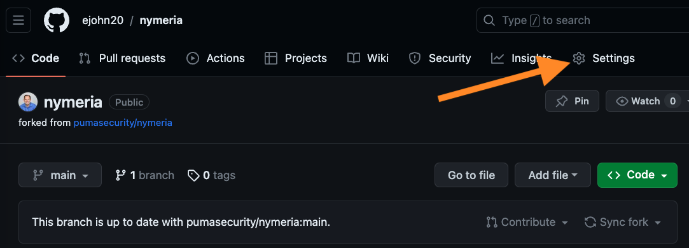
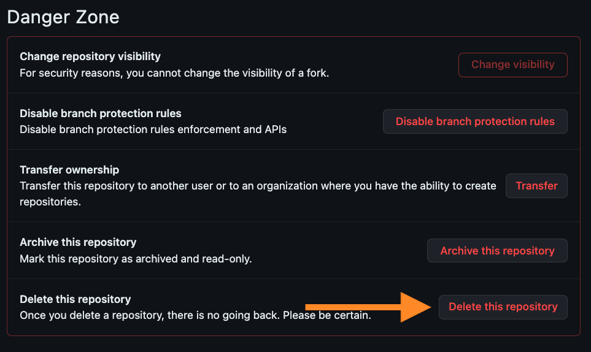

# Nymeria Workshop Teardown

Complete the following steps to destroy the resources created during the Nymeria workshop.

## Azure Subscription

Complete the following steps to destroy the resources created in your Azure subscription.

1. Sign into the [Azure Portal](https://portal.azure.com/){: target="_blank" rel="noopener"} and press the **Cloud Shell** icon next to the search box.

    

1. Run the following commands to destroy the resources created by the *Federated Identity* GitHub action.

    ```bash
    cd ~/clouddrive/nymeria/src/workshop/01_azure_init/
    export TF_VAR_resource_group_name=$(terraform output --json | jq -r '.resource_group_name.value')
    cd ~/clouddrive/nymeria/src/workshop/04_gh_action/
    export TF_VAR_aws_default_region="us-east-2"
    export TF_VAR_aws_access_key_id="AKIAEXAMPLE"
    export TF_VAR_aws_secret_access_key="EXAMPLESECRETACCESSKEY"
    export TF_VAR_aws_cross_cloud_role_arn="arn:aws:iam::123456789012:role/EXAMPLE"
    export TF_VAR_aws_s3_bucket_id="example-bucket"
    export TF_VAR_azure_virtual_machine_managed_identity_id="/subscriptions/EXAMPLE-SUBSCRIPTION-ID/resourceGroups/example-resource-group/providers/Microsoft.ManagedIdentity/userAssignedIdentities/example-managed-identity"
    export TF_VAR_google_cloud_project_id="nymeria-123456"
    export TF_VAR_google_cloud_service_account_key="ZXhhbXBsZQo="
    export TF_VAR_google_cloud_workload_identity_client_configuration="ZXhhbXBsZQo="
    export TF_VAR_gcs_bucket_id="example-bucket"
    terraform destroy -auto-approve
    ```

    !!! abstract "Terminal Output"
        ```bash
        Destroy complete! Resources: 12 destroyed.
        ```

1. Run the following commands to destroy the resources created by the configuration in the `~/clouddrive/nymeria/src/01_azure_init` directory.

    ```bash
    cd ~/clouddrive/nymeria/src/workshop/01_azure_init/
    export TF_VAR_github_organization=pumasecurity
    export TF_VAR_github_repository=nymeria
    terraform destroy -auto-approve
    ```

    !!! abstract "Terminal Output"
        ```bash
        Destroy complete! Resources: 10 destroyed.
        ```

## AWS Account

Complete the following steps to destroy the resources created in your AWS account.

1. Sign into the [AWS Web Console](https://console.aws.amazon.com/){: target="_blank" rel="noopener"}.

1. Set the region (top right-hand corner) to `us-east-2 (Ohio)`.

1. Press the **Cloud Shell** icon next to the search box.

    

1. Run the following commands to destroy the resources created by the configuration in the `~/clouddrive/nymeria/src/02_aws_init` directory.

    ```bash
    cd ~/nymeria/src/workshop/02_aws_init/
    export TF_VAR_azure_tenant_id="EXAMPLE-TENANT-ID"
    export TF_VAR_azure_virtual_machine_managed_identity_principal_id="EXAMPLE-PRINCIPAL-ID"
    terraform destroy -auto-approve
    ```

    !!! abstract "Terminal Output"
        ```bash
        Destroy complete! Resources: 10 destroyed.
        ```

## Google Cloud Project

Complete the following steps to destroy the resources created in your Google Cloud project.

1. Sign into the [Google Cloud Web Console](https://console.cloud.google.com/){: target="_blank" rel="noopener"}.

1. Select your project in the dropdown list (see #1 in the screenshot below).

1. Press the **Cloud Shell** icon next to the search box (see #3 in the screenshot below).

    

1. Run the following commands to destroy the resources created by the configuration in the `~/nymeria/src/workshop/03_gcp_init/` directory. You will need to **Authorize** the Cloud Shell to access your Google Cloud project.

    ```bash
    cd ~/nymeria/src/workshop/03_gcp_init/
    export TF_VAR_project_id=$(terraform output --json | jq -r '.gcp_project_id.value')
    export TF_VAR_azure_tenant_id="EXAMPLE-TENANT-ID"
    export TF_VAR_azure_virtual_machine_managed_identity_principal_id="EXAMPLE-PRINCIPAL-ID"
    terraform destroy -auto-approve
    ```

    !!! abstract "Terminal Output"
        ```bash
        Destroy complete! Resources: 14 destroyed.
        ```

## GitHub Repository

1. Browse to your Nymeria GitHub repository's **Settings**.

    

1. Delete the GitHub Nymeria GitHub repository

    
